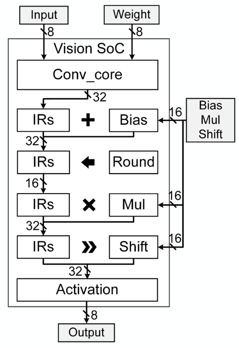

## **Standard Quantization Pipeline for DREMI Vision Processor**

Author: Zhao Mingxin, Zheng Xuemin

### **0. Overview**

### **1. Preliminary**

- **Which quantization data flow we adopt in the vision processor** ?

The main framework we implement in the vision processor is the same as the below paper.

But, there are two modifications:

1. The data format is 8-bit signed integer other than unsigned integer. Additionally,
to reduce the computation overhead, we do not use zero-point parameters here since
we find it does little impact on accuracy in terms of our application scenarios.

2. The convolution results (with biases added) before multiplying a multiplier and 
right-shift are saturated to 16-bit. Therefore, when we multiply them with the
multiplier, we can do this operation with 16-bit x 16-bit multiplication and store
the results to a 32-bit register without bothering to have a 64-bit register.

- **Which layer can be quantized** ?

Considering the hardware features and prevalent network structures, we currently
support several classical layers. For instance, Conv2d, Linear, Pooling (Avg/Max),
DepthwiseConv, and PointwiseConv are well-implemented in this pipeline.

- **What structure is supported in this pipeline** ?

As we know, the topology of convolution neural networks (CNN) can be extremely 
complicated. Without a well-defined static graph, quantizing a network with
massive branches and shortcuts is difficult. However, from a practical perspective,
we do not have to implement all these structures since some conventional effective
networks have been proven to be strong enough. 

Hence, we support the network structure like MobileNet v1/v2. Other structures may
be 

### 2. Project Progress

| **Operator** |  **Status**  |
|:----:|:----:|
|  Conv2d  |     √    |
|  DWConv2d  |     √    |
|  PWConv2d  |     √    |
|  Linear  |     √    |
|  Pooing  |     √    |
|   Add    |     √    |

**TODO:** 
